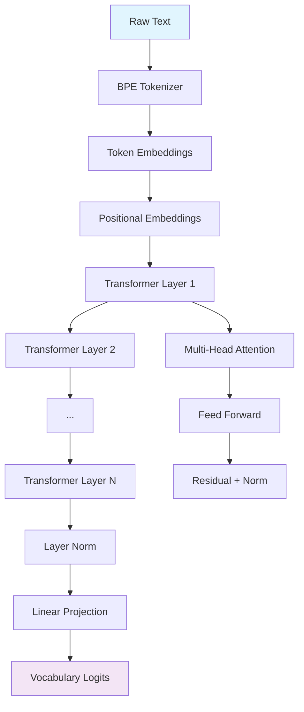

<div align="center">


# 🐹 HipGPT

### A GPT-2 Implementation in C++ and HIP for AMD GPUs

*An educational, from-scratch implementation of a GPT-style transformer model with custom BPE tokenizer and HIP-accelerated training*

[](https://opensource.org/licenses/MIT)
[](https://rocm.docs.amd.com/)
[](https://isocpp.org/)
[](https://hipgpt.github.io)

[📖 Documentation](https://hipgpt.github.io) • [🚀 Quick Start](#-quick-start) • [🏗️ Architecture](#️-architecture) • [🎯 Examples](#-examples)

</div>

---

## 🎯 What is HipGPT?

HipGPT is a **complete, educational implementation** of a GPT-2 style language model built from the ground up in modern C++. Unlike black-box implementations, every component—from the BPE tokenizer to the attention mechanisms—is implemented transparently using AMD's HIP API for GPU acceleration.

### 🎓 Perfect for Learning
- **Crystal Clear Code** — Every neural network operation implemented from scratch
- **Educational Focus** — Designed to teach transformer internals, not just use them
- **Complete Pipeline** — Data preprocessing, training, and inference all included
- **AMD GPU Showcase** — Demonstrates HIP API capabilities on ROCm-enabled hardware

### ⚡ Key Features

| Feature | Description |
|---------|-------------|
| 🔤 **Custom BPE Tokenizer** | Trainable on any text corpus, built from scratch |
| 🧠 **Full Transformer Stack** | Multi-head attention, feed-forward layers, layer norm |
| ⚡ **HIP GPU Kernels** | Custom CUDA-alternative kernels for AMD hardware |
| 📦 **Zero Dependencies** | Self-contained with automatic dependency management |
| 🛠️ **Research Ready** | Modular design for easy experimentation |

---

## 🚀 Quick Start

### Prerequisites
- **AMD GPU** with ROCm support (RX 6000/7000 series, MI series, etc.)
- **ROCm Toolkit** 5.0+ ([Installation Guide](https://rocm.docs.amd.com/en/latest/deploy/linux/index.html))
- **CMake** 3.21+ and a modern C++ compiler

### Installation & Training

```bash
# 1. Clone the repository
git clone https://github.com/aarnetalman/HipGPT.git
cd HipGPT

# 2. Download training data (Tiny Shakespeare)
./scripts/download_data.sh

# 3. Build the project
mkdir build && cd build
cmake .. -DCMAKE_CXX_COMPILER=/usr/bin/hipcc
make -j$(nproc)

# 4. Train your model
cd .. && ./scripts/run_train.sh
```

That's it! After training completes, you'll have a working language model ready for text generation.

---

## 🎯 Examples

### Text Generation
```bash
# Generate Shakespeare-style text
./build/generate --prompt "To be, or not to be:" --num_tokens 100

# More creative generation
./build/generate \
  --prompt "Once upon a time" \
  --num_tokens 150 \
  --top_k 50 \
  --temp 0.8
```

### Custom Training
```bash
# Train with custom hyperparameters
./scripts/run_train.sh \
  --vocab_size 2000 \
  --seq_length 64 \
  --learning_rate 5e-4 \
  --steps 2000
```

### Sample Output
```
Prompt: "To be, or not to be:"

Generated: "To be, or not to be: that is the question:
Whether 'tis nobler in the mind to suffer
The slings and arrows of outrageous fortune,
Or to take arms against a sea of troubles..."
```

---

## 🏗️ Architecture

<div align="center">



</div>

### Core Components

- **🔤 BPE Tokenizer** — Learns subword vocabulary from your training data
- **🧠 Transformer Layers** — Multi-head self-attention + position-wise FFN
- **⚡ HIP Kernels** — GPU-accelerated matrix operations, attention, and activations
- **🎯 Training Loop** — Adam optimizer with gradient accumulation and checkpointing

---

## 📊 Model Specifications

### Default Configuration
```cpp
Embedding Dimension:     128
Number of Layers:        2
Attention Heads:         4
Feed-Forward Hidden:     256
Vocabulary Size:         ~5,000
Context Length:          32
```

### Parameter Count
**~1.55M trainable parameters** (6.2 MB in FP32)

Perfect size for:
- 🎓 Educational exploration
- 💻 Running on consumer GPUs
- ⚡ Fast iteration cycles
- 🔬 Research prototyping

---

## 📂 Project Structure

```
HipGPT/
├── 📁 include/           # Public API headers
│   ├── gpt_model.h       # Main model interface
│   ├── tokenizer.h       # BPE tokenizer
│   └── hip_kernels.h     # GPU kernel declarations
├── 📁 src/               # Implementation
│   ├── train_gpt.cpp     # Training entry point
│   ├── generate.cpp      # Text generation CLI
│   ├── gpt_model.cpp     # Model orchestration
│   └── hip_kernels.cpp   # GPU kernel implementations
├── 📁 scripts/           # Automation
│   ├── download_data.sh  # Dataset fetching
│   └── run_train.sh      # Training pipeline
└── 📁 data/              # Training data
    └── tiny_shakespeare.txt
```

---

## 🔧 Advanced Usage

### Custom Datasets
```bash
# Train on your own text file
./build/train_gpt --data_file your_dataset.txt
```

### Hyperparameter Tuning
```bash
# Experiment with model architecture
./build/train_gpt \
  --embed_dim 256 \
  --num_layers 4 \
  --num_heads 8 \
  --learning_rate 3e-4 \
  --batch_size 64
```

### Checkpointing & Resume
```bash
# Resume training from checkpoint
./build/train_gpt --resume_from gpt_checkpoint.bin
```

---

## 🤝 Contributing

We welcome contributions! Here's how you can help:

- 🐛 **Bug Reports** — Found an issue? Please open a GitHub issue
- 🚀 **Feature Requests** — Ideas for improvements are always welcome
- 📖 **Documentation** — Help make the docs even clearer
- 💡 **Code Contributions** — Submit PRs for bug fixes or new features

### Development Setup
```bash
# Clone with submodules
git clone --recursive https://github.com/aarnetalman/HipGPT.git

# Run tests (if available)
cd build && make test
```

---

## 📄 License

This project is licensed under the [MIT License](LICENSE) - see the LICENSE file for details.

</div>